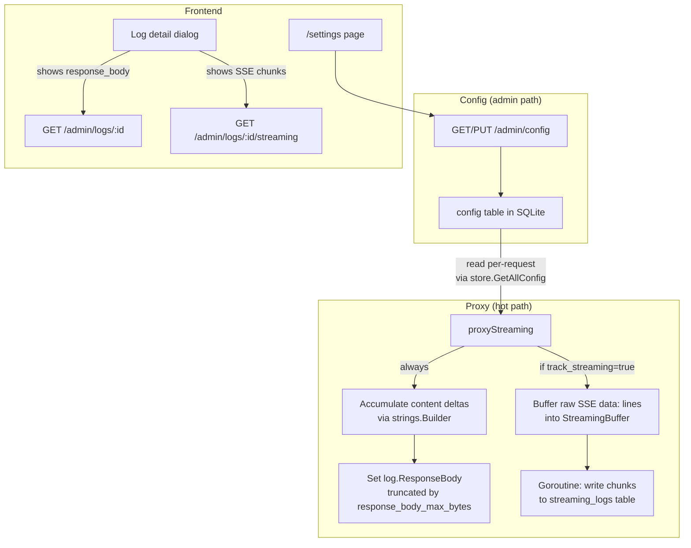

# Logging Configuration & Streaming Response Logging

## Overview

This plan replaces the hardcoded 50KB body truncation in the proxy with admin-configurable limits (0 to 1GB, independent for request and response), and adds streaming response logging that both reconstructs a full response body and stores individual SSE chunks in a separate table.

## Architecture




**Performance guarantee:** The streaming proxy continues to forward-and-flush each SSE line to the client immediately. Content delta extraction and chunk buffering happen in-memory *after* each line is already flushed. DB writes for streaming chunks happen in a goroutine *after* the stream completes. TTFT and per-token latency are unaffected.

---

## Configuration Keys


| Key                       | Type    | Default      | Min        | Max              | Description                                                  |
| ------------------------- | ------- | ------------ | ---------- | ---------------- | ------------------------------------------------------------ |
| `request_body_max_bytes`  | integer | 51200 (50KB) | 0          | 1073741824 (1GB) | Max bytes stored for request body. 0 = no limit.             |
| `response_body_max_bytes` | integer | 51200 (50KB) | 0          | 1073741824 (1GB) | Max bytes stored for response body. 0 = no limit.            |
| `track_streaming`         | boolean | false        | -          | -                | Store individual SSE chunks in streaming_logs table.         |
| `streaming_buffer_size`   | integer | 10240 (10KB) | 1024 (1KB) | 1048576 (1MB)    | Max in-memory bytes for SSE chunk buffer (rolling eviction). |


---

## Phase 1: Database Migrations

### Files to Create

- `internal/db/migrations/0006_logging_config.up.sql`
- `internal/db/migrations/0006_logging_config.down.sql`
- `internal/db/migrations/0007_streaming_logs.up.sql`
- `internal/db/migrations/0007_streaming_logs.down.sql`

Note: last existing migration is `0005_fix_double_plus_timestamps.up.sql`. Migrations are auto-applied at startup via `runMigrationsWithLog` in `internal/db/sqlite.go` which reads all `*.up.sql` files from the embedded `migrations/` dir, sorted alphabetically.

### 0006_logging_config.up.sql

```sql
CREATE TABLE IF NOT EXISTS config (
    key TEXT PRIMARY KEY,
    value TEXT NOT NULL,
    updated_at DATETIME NOT NULL DEFAULT (datetime('now'))
);

INSERT OR IGNORE INTO config (key, value, updated_at) VALUES
    ('request_body_max_bytes', '51200', datetime('now'));
INSERT OR IGNORE INTO config (key, value, updated_at) VALUES
    ('response_body_max_bytes', '51200', datetime('now'));
INSERT OR IGNORE INTO config (key, value, updated_at) VALUES
    ('track_streaming', 'false', datetime('now'));
INSERT OR IGNORE INTO config (key, value, updated_at) VALUES
    ('streaming_buffer_size', '10240', datetime('now'));
```

### 0006_logging_config.down.sql

```sql
DROP TABLE IF EXISTS config;
```

### 0007_streaming_logs.up.sql

```sql
CREATE TABLE IF NOT EXISTS streaming_logs (
    id TEXT PRIMARY KEY,
    request_log_id TEXT NOT NULL REFERENCES request_logs(id) ON DELETE CASCADE,
    chunk_index INTEGER NOT NULL,
    timestamp DATETIME NOT NULL,
    data TEXT NOT NULL,
    is_truncated BOOLEAN NOT NULL DEFAULT 0,
    created_at DATETIME NOT NULL DEFAULT (datetime('now'))
);

CREATE INDEX IF NOT EXISTS idx_streaming_logs_request ON streaming_logs(request_log_id);
CREATE INDEX IF NOT EXISTS idx_streaming_logs_chunk ON streaming_logs(chunk_index);
CREATE INDEX IF NOT EXISTS idx_streaming_logs_timestamp ON streaming_logs(timestamp);
```

### 0007_streaming_logs.down.sql

```sql
DROP TABLE IF EXISTS streaming_logs;
```

---

## Phase 2: Backend -- Config Model & Store

### New File: `internal/models/config.go`

```go
package models

const (
    DefaultRequestBodyMaxBytes  = 51200       // 50KB
    DefaultResponseBodyMaxBytes = 51200       // 50KB
    DefaultTrackStreaming       = false
    DefaultStreamingBufferSize  = 10240       // 10KB
    MaxBodyMaxBytes             = 1073741824  // 1GB
    MinStreamingBufferSize      = 1024        // 1KB
    MaxStreamingBufferSize      = 1048576     // 1MB
)

type Configuration struct {
    RequestBodyMaxBytes  int  `json:"request_body_max_bytes"`
    ResponseBodyMaxBytes int  `json:"response_body_max_bytes"`
    TrackStreaming       bool `json:"track_streaming"`
    StreamingBufferSize  int  `json:"streaming_buffer_size"`
}

func DefaultConfiguration() Configuration {
    return Configuration{
        RequestBodyMaxBytes:  DefaultRequestBodyMaxBytes,
        ResponseBodyMaxBytes: DefaultResponseBodyMaxBytes,
        TrackStreaming:       DefaultTrackStreaming,
        StreamingBufferSize:  DefaultStreamingBufferSize,
    }
}
```

### New File: `internal/models/streaming_log.go`

```go
package models

import "time"

type StreamingLog struct {
    ID           string    `json:"id"`
    RequestLogID string    `json:"request_log_id"`
    ChunkIndex   int       `json:"chunk_index"`
    Data         string    `json:"data"`
    IsTruncated  bool      `json:"is_truncated"`
    Timestamp    time.Time `json:"timestamp"`
    CreatedAt    time.Time `json:"created_at"`
}
```

### Modify: `internal/db/store.go`

Add these methods to the `Store` interface, in a new `--- Configuration ---` section and a new `--- Streaming Logs ---` section:

```go
// --- Configuration ---

// GetAllConfig returns all config key-value pairs.
GetAllConfig(ctx context.Context) (map[string]string, error)

// SetConfig upserts a single config key-value pair.
SetConfig(ctx context.Context, key, value string) error

// --- Streaming Logs ---

// InsertStreamingLog inserts a single streaming log chunk.
InsertStreamingLog(ctx context.Context, log *models.StreamingLog) error

// GetStreamingLogs returns all streaming log chunks for a request, ordered by chunk_index.
GetStreamingLogs(ctx context.Context, requestLogID string) ([]models.StreamingLog, error)
```

### New File: `internal/db/sqlite_config.go`

SQLite implementation for config methods:

```go
package db

import (
    "context"
    "fmt"
    "time"
)

func (s *SQLiteStore) GetAllConfig(ctx context.Context) (map[string]string, error) {
    rows, err := s.db.QueryContext(ctx, `SELECT key, value FROM config`)
    if err != nil {
        return nil, fmt.Errorf("get all config: %w", err)
    }
    defer rows.Close()
    result := make(map[string]string)
    for rows.Next() {
        var k, v string
        if err := rows.Scan(&k, &v); err != nil {
            return nil, fmt.Errorf("scan config row: %w", err)
        }
        result[k] = v
    }
    return result, rows.Err()
}

func (s *SQLiteStore) SetConfig(ctx context.Context, key, value string) error {
    _, err := s.db.ExecContext(ctx,
        `INSERT INTO config (key, value, updated_at) VALUES (?, ?, ?)
         ON CONFLICT(key) DO UPDATE SET value = excluded.value, updated_at = excluded.updated_at`,
        key, value, time.Now().UTC(),
    )
    if err != nil {
        return fmt.Errorf("set config %s: %w", key, err)
    }
    return nil
}
```

### New File: `internal/db/sqlite_streaming_log.go`

```go
package db

import (
    "context"
    "fmt"
    "time"

    "github.com/google/uuid"
    "github.com/llmate/gateway/internal/models"
)

func (s *SQLiteStore) InsertStreamingLog(ctx context.Context, log *models.StreamingLog) error {
    if log.ID == "" {
        log.ID = uuid.NewString()
    }
    if log.CreatedAt.IsZero() {
        log.CreatedAt = time.Now().UTC()
    }
    if log.Timestamp.IsZero() {
        log.Timestamp = log.CreatedAt
    }
    _, err := s.db.ExecContext(ctx,
        `INSERT INTO streaming_logs (id, request_log_id, chunk_index, timestamp, data, is_truncated, created_at)
         VALUES (?, ?, ?, ?, ?, ?, ?)`,
        log.ID, log.RequestLogID, log.ChunkIndex,
        log.Timestamp, log.Data, log.IsTruncated, log.CreatedAt,
    )
    if err != nil {
        return fmt.Errorf("insert streaming log: %w", err)
    }
    return nil
}

func (s *SQLiteStore) GetStreamingLogs(ctx context.Context, requestLogID string) ([]models.StreamingLog, error) {
    rows, err := s.db.QueryContext(ctx,
        `SELECT id, request_log_id, chunk_index, timestamp, data, is_truncated, created_at
         FROM streaming_logs WHERE request_log_id = ? ORDER BY chunk_index ASC`,
        requestLogID,
    )
    if err != nil {
        return nil, fmt.Errorf("get streaming logs: %w", err)
    }
    defer rows.Close()
    var logs []models.StreamingLog
    for rows.Next() {
        var l models.StreamingLog
        var ts, ca timeScanner
        if err := rows.Scan(&l.ID, &l.RequestLogID, &l.ChunkIndex, &ts, &l.Data, &l.IsTruncated, &ca); err != nil {
            return nil, fmt.Errorf("scan streaming log: %w", err)
        }
        l.Timestamp = ts.Time
        l.CreatedAt = ca.Time
        logs = append(logs, l)
    }
    return logs, rows.Err()
}
```

---

## Phase 3: Backend -- Config Admin API

### New File: `internal/admin/config_handler.go`

Create a `ConfigHandler` struct that holds a `db.Store`:

```go
package admin

import (
    "encoding/json"
    "fmt"
    "net/http"
    "strconv"

    "github.com/llmate/gateway/internal/db"
    "github.com/llmate/gateway/internal/models"
)

type ConfigHandler struct {
    store db.Store
}

func NewConfigHandler(store db.Store) *ConfigHandler {
    return &ConfigHandler{store: store}
}
```

**Endpoints:**

#### `HandleGetConfig` -- `GET /admin/config`

- Call `store.GetAllConfig(ctx)`, parse values into `models.Configuration`, apply defaults for missing keys.
- Respond 200 with the `Configuration` JSON.

#### `HandleUpdateConfig` -- `PUT /admin/config`

- Decode request body as `map[string]json.RawMessage` (partial update -- only provided keys are updated).
- For each key present, validate:
  - `request_body_max_bytes`: integer, 0 <= value <= 1073741824
  - `response_body_max_bytes`: integer, 0 <= value <= 1073741824
  - `track_streaming`: boolean
  - `streaming_buffer_size`: integer, 1024 <= value <= 1048576
- Call `store.SetConfig(ctx, key, stringValue)` for each valid key.
- On validation error, respond 400 with `{"error": "<message>"}`.
- After all updates, call `store.GetAllConfig(ctx)` and respond 200 with the full merged `Configuration`.

#### `HandleConfigDefinition` -- `GET /admin/config/definition`

- Return a static JSON object describing the schema (type, default, min, max, description for each key). This is hardcoded, no DB call needed.

### Modify: `internal/admin/handler.go`

The `Handler` struct already holds a `store db.Store`. The config routes can either be:

**Option A (preferred):** Add a `ConfigHandler` as a field on the existing `Handler` struct and register routes in `Routes()`:

```go
// In Routes(), add:
r.Get("/config", h.configHandler.HandleGetConfig)
r.Put("/config", h.configHandler.HandleUpdateConfig)
r.Get("/config/definition", h.configHandler.HandleConfigDefinition)
```

**Option B:** Create a separate `ConfigHandler` in `cmd/gateway/main.go` and mount it. Either approach is fine -- Option A keeps all admin routes in one `Routes()` method.

Also add the streaming logs endpoint:

```go
r.Get("/logs/{id}/streaming", h.HandleGetStreamingLogs)
```

### `HandleGetStreamingLogs` -- `GET /admin/logs/{id}/streaming`

Add to `internal/admin/handler.go`:

- Extract `id` from URL params.
- Call `store.GetStreamingLogs(ctx, id)`.
- Respond 200 with `{"streaming_logs": [...]}`.
- If empty, return empty array (not null).

---

## Phase 4: Backend -- Configurable Truncation

### Modify: `internal/proxy/handler.go`

**Remove** the hardcoded constant:

```go
// DELETE THIS:
const maxBodyBytes = 50 * 1024 // 50 KB
```

**Replace** `truncateBody` with:

```go
// truncateBodyWithConfig returns body as a string, truncated to maxBytes.
// maxBytes == 0 means no truncation (store entire body).
// Appends "[truncated]" suffix when cut.
func truncateBodyWithConfig(b []byte, maxBytes int) string {
    if maxBytes == 0 || len(b) <= maxBytes {
        return string(b)
    }
    return string(b[:maxBytes]) + "\n[truncated]"
}
```

**Add** a config-loading helper:

```go
func getConfigInt(config map[string]string, key string, defaultValue int) int {
    if val, ok := config[key]; ok {
        if v, err := strconv.Atoi(val); err == nil {
            return v
        }
    }
    return defaultValue
}

func getConfigBool(config map[string]string, key string, defaultValue bool) bool {
    if val, ok := config[key]; ok {
        return val == "true"
    }
    return defaultValue
}
```

**In `proxyNonStreaming`** (currently lines 390-395), load config and use it:

```go
// Load logging config (fallback to defaults on error)
logConfig, configErr := h.store.GetAllConfig(r.Context())
if configErr != nil {
    h.logger.Warn("failed to load logging config, using defaults", "error", configErr)
    logConfig = map[string]string{}
}
reqMax := getConfigInt(logConfig, "request_body_max_bytes", models.DefaultRequestBodyMaxBytes)
respMax := getConfigInt(logConfig, "response_body_max_bytes", models.DefaultResponseBodyMaxBytes)

// Replace: log.RequestBody = truncateBody(body, maxBodyBytes)
// With:
log.RequestBody = truncateBodyWithConfig(body, reqMax)

// Replace: log.ResponseBody = truncateBody(respBody, maxBodyBytes)
// With:
log.ResponseBody = truncateBodyWithConfig(respBody, respMax)
```

Config should be loaded once at the start of `proxyNonStreaming`, before the retry loop. The same `logConfig` map is reused for all attempts.

**In `handleStreamingRequest`** (currently line 791), same pattern:

```go
logConfig, configErr := h.store.GetAllConfig(r.Context())
if configErr != nil {
    h.logger.Warn("failed to load logging config, using defaults", "error", configErr)
    logConfig = map[string]string{}
}
reqMax := getConfigInt(logConfig, "request_body_max_bytes", models.DefaultRequestBodyMaxBytes)

// Replace: RequestBody: truncateBody(body, maxBodyBytes),
// With:
RequestBody: truncateBodyWithConfig(body, reqMax),
```

The `logConfig` map is also passed through to `proxyStreaming` for the streaming logging (Phase 5).

### Update model comment

In `internal/models/request_log.go`, update the comment on line 28:

```go
// Request and response bodies, truncated per admin config. May be populated for streaming responses.
```

---

## Phase 5: Backend -- Streaming Response Logging

### Modify: `internal/proxy/streaming.go`

#### Add `StreamingBuffer` type

```go
import "sync"

// StreamingBuffer accumulates raw SSE data: lines with a configurable max size.
// When adding a chunk would exceed maxSize, oldest chunks are evicted (rolling window).
type StreamingBuffer struct {
    mu      sync.Mutex
    chunks  []string
    maxSize int
    current int
}

func NewStreamingBuffer(maxSize int) *StreamingBuffer {
    return &StreamingBuffer{
        chunks:  make([]string, 0),
        maxSize: maxSize,
    }
}

func (b *StreamingBuffer) Add(chunk string) {
    b.mu.Lock()
    defer b.mu.Unlock()
    for b.current+len(chunk) > b.maxSize && len(b.chunks) > 0 {
        b.current -= len(b.chunks[0])
        b.chunks = b.chunks[1:]
    }
    b.chunks = append(b.chunks, chunk)
    b.current += len(chunk)
}

func (b *StreamingBuffer) GetAll() []string {
    b.mu.Lock()
    defer b.mu.Unlock()
    result := make([]string, len(b.chunks))
    copy(result, b.chunks)
    return result
}
```

#### Modify `proxyStreaming` signature

Current signature:

```go
func (h *Handler) proxyStreaming(w http.ResponseWriter, backendResp *http.Response, startTime time.Time) (usage *UsageInfo, ttftMs *int, err error)
```

New signature:

```go
func (h *Handler) proxyStreaming(w http.ResponseWriter, backendResp *http.Response, startTime time.Time, logConfig map[string]string) (usage *UsageInfo, ttftMs *int, reconstructedBody string, chunks []string, err error)
```

#### Inside `proxyStreaming`, add before the `for scanner.Scan()` loop:

```go
// Response body reconstruction: always accumulate content deltas.
var bodyBuilder strings.Builder
respMax := getConfigInt(logConfig, "response_body_max_bytes", models.DefaultResponseBodyMaxBytes)
bodyCapReached := false

// Optional chunk-level tracking.
trackStreaming := getConfigBool(logConfig, "track_streaming", false)
var buffer *StreamingBuffer
if trackStreaming {
    bufSize := getConfigInt(logConfig, "streaming_buffer_size", models.DefaultStreamingBufferSize)
    buffer = NewStreamingBuffer(bufSize)
}
```

#### Inside the `for scanner.Scan()` loop, after the existing usage-extraction block:

Add content delta extraction:

```go
// Extract content delta for response body reconstruction.
if !bodyCapReached {
    var delta struct {
        Choices []struct {
            Delta struct {
                Content string `json:"content"`
            } `json:"delta"`
        } `json:"choices"`
    }
    if jsonErr := json.Unmarshal([]byte(payload), &delta); jsonErr == nil {
        for _, c := range delta.Choices {
            if c.Delta.Content != "" {
                bodyBuilder.WriteString(c.Delta.Content)
                // Stop accumulating if we've exceeded the configured limit
                // (0 means no limit).
                if respMax > 0 && bodyBuilder.Len() > respMax {
                    bodyCapReached = true
                }
            }
        }
    }
}

// Buffer raw SSE line for chunk-level storage.
if buffer != nil {
    buffer.Add(line)
}
```

#### At the return points (both the `[DONE]` early return and the end of function), gather results:

```go
reconstructed := bodyBuilder.String()
var chunkList []string
if buffer != nil {
    chunkList = buffer.GetAll()
}
return usage, ttftMs, reconstructed, chunkList, nil
```

All three return paths in the current function must be updated to return the extra values.

### Modify: `internal/proxy/handler.go` -- `handleStreamingRequest`

After the call to `proxyStreaming` (currently line 931), update to use the new signature and handle the results:

```go
// Current line 931:
// usage, ttftMs, streamErr := h.proxyStreaming(w, resp, startTime)

// New:
usage, ttftMs, reconstructedBody, streamChunks, streamErr := h.proxyStreaming(w, resp, startTime, logConfig)

// ... (existing log population code stays the same) ...

// After usage is applied to log, add reconstructed response body:
respMax := getConfigInt(logConfig, "response_body_max_bytes", models.DefaultResponseBodyMaxBytes)
if reconstructedBody != "" {
    log.ResponseBody = truncateBodyWithConfig([]byte(reconstructedBody), respMax)
}

// Fire goroutine to persist streaming chunks (non-blocking).
if len(streamChunks) > 0 {
    logID := log.ID
    go h.saveStreamingChunks(logID, streamChunks)
}

h.metrics.Record(log)
```

#### Add `saveStreamingChunks` method:

```go
func (h *Handler) saveStreamingChunks(requestLogID string, chunks []string) {
    ctx, cancel := context.WithTimeout(context.Background(), 10*time.Second)
    defer cancel()
    for i, chunk := range chunks {
        sl := &models.StreamingLog{
            RequestLogID: requestLogID,
            ChunkIndex:   i,
            Data:         chunk,
            Timestamp:    time.Now().UTC(),
        }
        if err := h.store.InsertStreamingLog(ctx, sl); err != nil {
            h.logger.Warn("failed to save streaming chunk", "error", err, "request_log_id", requestLogID, "chunk_index", i)
            return
        }
    }
}
```

---

## Phase 6: Frontend -- Types & API Client

### Modify: `frontend/src/lib/types/index.ts`

Add these interfaces at the end of the file:

```typescript
export interface Configuration {
  request_body_max_bytes: number;
  response_body_max_bytes: number;
  track_streaming: boolean;
  streaming_buffer_size: number;
}

export interface ConfigField {
  type: 'integer' | 'boolean';
  default: number | boolean;
  min?: number;
  max?: number;
  description: string;
}

export interface ConfigDefinition {
  request_body_max_bytes: ConfigField;
  response_body_max_bytes: ConfigField;
  track_streaming: ConfigField;
  streaming_buffer_size: ConfigField;
}

export interface StreamingLog {
  id: string;
  request_log_id: string;
  chunk_index: number;
  data: string;
  is_truncated: boolean;
  timestamp: string;
  created_at: string;
}
```

### Modify: `frontend/src/lib/api/client.ts`

Add these imports at the top (extend the existing import):

```typescript
import type { Configuration, ConfigDefinition, StreamingLog } from '$lib/types';
```

Add these methods to the `ApiClient` class:

```typescript
async getConfig(): Promise<Configuration> {
    return this.request<Configuration>('GET', '/config');
}

async updateConfig(config: Partial<Configuration>): Promise<Configuration> {
    return this.request<Configuration>('PUT', '/config', config);
}

async getConfigDefinition(): Promise<ConfigDefinition> {
    return this.request<ConfigDefinition>('GET', '/config/definition');
}

async getStreamingLogs(requestLogId: string): Promise<StreamingLog[]> {
    const data = await this.request<{ streaming_logs: StreamingLog[] }>(
        'GET',
        `/logs/${encodeURIComponent(requestLogId)}/streaming`
    );
    return data.streaming_logs;
}
```

---

## Phase 7: Frontend -- Settings Page

### Modify: `frontend/src/lib/components/Sidebar.svelte`

Add `{ label: 'Settings', path: '/settings' }` to the `navItems` array, after `Logs`:

```typescript
const navItems = [
    { label: 'Dashboard', path: '/' },
    { label: 'Providers', path: '/providers' },
    { label: 'Models', path: '/models' },
    { label: 'Logs', path: '/logs' },
    { label: 'Settings', path: '/settings' }
] as const;
```

### New File: `frontend/src/routes/(dashboard)/settings/+page.svelte`

This page provides a form for all 4 configuration values. Use Svelte 5 runes ($state, $derived, $effect). Use shadcn-svelte components (Button, Input, Card, CardContent). Use the existing `api` singleton.

**Key UX requirements:**

- Load config on mount via `api.getConfig()`.
- Display request/response body max bytes as number inputs. Show a human-readable helper (e.g., "50 KB", "1 GB") next to the raw byte value. Step of 1024 for usability.
- Track streaming: checkbox/toggle.
- Streaming buffer size: displayed in KB (1-1024), stored in bytes (multiply by 1024 for API). Disabled when track_streaming is false.
- Save button: enabled only when form is dirty (values differ from loaded config). Shows "Saving..." while in-flight. Calls `api.updateConfig(changedFields)`.
- Reset to Defaults button: resets form to default values (51200, 51200, false, 10240), marks as dirty so user can save.
- Success/error feedback: show a status message below the buttons (not a toast library -- keep it simple).
- Client-side validation before submit:
  - `request_body_max_bytes`: 0 <= value <= 1073741824
  - `response_body_max_bytes`: 0 <= value <= 1073741824
  - `streaming_buffer_size`: 1024 <= value <= 1048576 (when track_streaming is true)

---

## Phase 8: Frontend -- Streaming Logs in Detail View

### Modify: `frontend/src/routes/(dashboard)/logs/+page.svelte`

In the log detail dialog (the `{#if showDetail}` block starting at line 349):

1. **Response body for streaming**: The reconstructed `response_body` will now be populated for streaming requests. Update the response body section to remove the "(streaming -- not captured)" label when `response_body` is present. Change the condition:

```svelte
<!-- Current (line 506-517): -->
<h3 class="text-sm font-medium">
    Response Body
    {#if detailLog.is_streamed}
        <span class="ml-1 text-xs font-normal text-muted-foreground">(streaming — not captured)</span>
    {/if}
</h3>
{#if detailLog.response_body}
    <pre ...>{prettyJSON(detailLog.response_body)}</pre>
{:else}
    <p class="text-xs text-muted-foreground">{detailLog.is_streamed ? 'Streaming responses are not buffered.' : 'Not captured.'}</p>
{/if}

<!-- New: -->
<h3 class="text-sm font-medium">
    Response Body
    {#if detailLog.is_streamed && detailLog.response_body}
        <span class="ml-1 text-xs font-normal text-muted-foreground">(reconstructed from stream)</span>
    {/if}
</h3>
{#if detailLog.response_body}
    <pre ...>{prettyJSON(detailLog.response_body)}</pre>
{:else}
    <p class="text-xs text-muted-foreground">{detailLog.is_streamed ? 'Enable response body logging in Settings to capture streaming responses.' : 'Not captured.'}</p>
{/if}
```

1. **Streaming chunks section**: Add a collapsible section after the response body, visible only for streamed requests:

```svelte
{#if detailLog.is_streamed}
    <div class="space-y-1">
        <details class="group">
            <summary class="cursor-pointer list-none text-sm font-medium hover:text-primary">
                <span class="inline-block mr-1 transition-transform group-open:rotate-90">›</span>
                Streaming Chunks
            </summary>
            <!-- On open, lazy-load chunks via api.getStreamingLogs(detailLog.id) -->
            <!-- Display: chunk_index, timestamp, data in a scrollable list -->
            <!-- Show "No streaming chunks recorded. Enable streaming tracking in Settings." if empty -->
        </details>
    </div>
{/if}
```

Add state variables for streaming chunks (`streamingChunks`, `streamingChunksLoading`, `streamingChunksError`). Load chunks lazily when the details element is toggled open (use an `ontoggle` handler or load in `openDetail` for streamed requests).

---

## Testing Requirements

### Go Unit Tests

#### `internal/proxy/handler_test.go`

```go
func TestTruncateBodyWithConfig(t *testing.T) {
    // Test cases:
    // - maxBytes=0 (no limit): returns full body
    // - body shorter than maxBytes: returns full body
    // - body exactly maxBytes: returns full body
    // - body longer than maxBytes: returns truncated + "\n[truncated]"
    // - empty body with any maxBytes: returns ""
    // - maxBytes=1: returns first byte + "\n[truncated]" for multi-byte body
}

func TestGetConfigInt(t *testing.T) {
    // - key present with valid int: returns parsed value
    // - key present with non-int: returns default
    // - key missing: returns default
    // - nil map: returns default
}

func TestGetConfigBool(t *testing.T) {
    // - "true": returns true
    // - "false": returns false
    // - missing: returns default
}
```

#### `internal/proxy/streaming_test.go`

```go
func TestStreamingBuffer(t *testing.T) {
    // - Add chunks under maxSize: all present in GetAll()
    // - Add chunks exceeding maxSize: oldest evicted, total <= maxSize
    // - Add single chunk larger than maxSize: only that chunk present (evicts all prior)
    // - Empty buffer: GetAll() returns empty slice
    // - Concurrent Add calls: no data race (use -race flag)
}
```

#### `internal/admin/config_handler_test.go`

```go
func TestHandleGetConfig(t *testing.T) {
    // - Returns 200 with all 4 config values
    // - Returns defaults when config table is empty/partially populated
}

func TestHandleUpdateConfig(t *testing.T) {
    // - Partial update (only request_body_max_bytes): returns full config with updated value
    // - Invalid value (negative): returns 400
    // - Invalid value (over max): returns 400
    // - Invalid type: returns 400
    // - Empty body: returns 200 with unchanged config
    // - Update all 4 values: all persisted correctly
}

func TestHandleConfigDefinition(t *testing.T) {
    // - Returns 200 with schema for all 4 keys
}

func TestHandleGetStreamingLogs(t *testing.T) {
    // - Returns empty array when no chunks exist
    // - Returns chunks ordered by chunk_index when they exist
    // - Returns 404 or empty for nonexistent request_log_id
}
```

#### `internal/db/sqlite_config_test.go`

```go
func TestGetAllConfig(t *testing.T) {
    // - Returns seeded default values after migration
}

func TestSetConfig(t *testing.T) {
    // - Insert new key
    // - Update existing key (upsert)
    // - Verify updated_at changes
}
```

#### `internal/db/sqlite_streaming_log_test.go`

```go
func TestInsertAndGetStreamingLogs(t *testing.T) {
    // - Insert multiple chunks, get them back ordered by chunk_index
    // - FK constraint: inserting with nonexistent request_log_id fails
    // - Cascade: deleting request_log deletes associated streaming_logs
}
```

### Frontend Verification

After all frontend changes, run:

```bash
cd frontend && npm run check
```

### Go Build & Test

After all Go changes, run:

```bash
go build ./...
go test ./internal/proxy/ ./internal/admin/ ./internal/db/ -v
```

---

## Implementation Strategy

This feature spans backend (Go) and frontend (Svelte) across multiple packages. The implementing agent should use **parallel sub-agents** to maximize efficiency while respecting dependencies between phases.

### Dependency Graph

```
Phase 1 (migrations) ──┬──> Phase 2 (config model + store)
                        │
                        └──> Phase 5 (streaming log store)
                                │
Phase 2 ──> Phase 3 (config admin API) ──> Phase 6 (frontend types + API client)
                                                │
Phase 2 ──> Phase 4 (truncation in proxy) ──────┤
                                                │
Phase 5 ──> Phase 4+5 (streaming in proxy) ─────┤
                                                │
Phase 6 ──> Phase 7 (settings page) ────────────┤
Phase 6 ──> Phase 8 (log detail streaming UI) ──┘
```

### Recommended Sub-Agent Strategy

**Wave 1 -- Foundation (sequential, one agent):**

- Phase 1: Create all 4 migration files.
- Phase 2: Create `models/config.go`, `models/streaming_log.go`, update `db/store.go`, create `db/sqlite_config.go`, create `db/sqlite_streaming_log.go`.
- Run `go build ./...` to verify compilation.

**Wave 2 -- Backend features (can be parallelized as 2 agents):**

- **Agent A:** Phase 3 (config admin API) + Phase 4 (truncation in proxy). Create `admin/config_handler.go`, wire routes in `admin/handler.go`, modify `proxy/handler.go` to use config-driven truncation.
- **Agent B:** Phase 5 (streaming in proxy). Modify `proxy/streaming.go` to add `StreamingBuffer`, update `proxyStreaming` signature, add response body reconstruction and chunk buffering. Update `handleStreamingRequest` in `proxy/handler.go` to handle new return values and fire chunk-save goroutine. Add streaming logs admin endpoint.

*Note:* Both agents modify `proxy/handler.go` -- Agent A modifies `proxyNonStreaming` and the config loading in `handleStreamingRequest`, while Agent B modifies `proxyStreaming` and the post-stream code in `handleStreamingRequest`. If run in parallel, merge carefully. If simpler, run sequentially.

**Wave 3 -- Frontend (one agent, or two parallel):**

- Phase 6: Add types and API client methods.
- Phase 7: Create settings page, update sidebar.
- Phase 8: Update log detail dialog.

**Wave 4 -- Testing (one agent):**

- Write all Go test files listed in Testing Requirements.
- Run `go build ./...` and `go test ./...`.
- Run `cd frontend && npm run check`.

### Key Files Reference


| File                                                    | Action                                                       | Phase |
| ------------------------------------------------------- | ------------------------------------------------------------ | ----- |
| `internal/db/migrations/0006_logging_config.up.sql`     | CREATE                                                       | 1     |
| `internal/db/migrations/0006_logging_config.down.sql`   | CREATE                                                       | 1     |
| `internal/db/migrations/0007_streaming_logs.up.sql`     | CREATE                                                       | 1     |
| `internal/db/migrations/0007_streaming_logs.down.sql`   | CREATE                                                       | 1     |
| `internal/models/config.go`                             | CREATE                                                       | 2     |
| `internal/models/streaming_log.go`                      | CREATE                                                       | 2     |
| `internal/models/request_log.go`                        | MODIFY (comment only)                                        | 4     |
| `internal/db/store.go`                                  | MODIFY (add 4 methods)                                       | 2     |
| `internal/db/sqlite_config.go`                          | CREATE                                                       | 2     |
| `internal/db/sqlite_streaming_log.go`                   | CREATE                                                       | 2     |
| `internal/admin/config_handler.go`                      | CREATE                                                       | 3     |
| `internal/admin/handler.go`                             | MODIFY (add routes, add streaming logs handler)              | 3, 5  |
| `internal/proxy/handler.go`                             | MODIFY (truncation, config loading, streaming wiring)        | 4, 5  |
| `internal/proxy/streaming.go`                           | MODIFY (StreamingBuffer, new signature, body reconstruction) | 5     |
| `frontend/src/lib/types/index.ts`                       | MODIFY (add 4 interfaces)                                    | 6     |
| `frontend/src/lib/api/client.ts`                        | MODIFY (add 4 methods)                                       | 6     |
| `frontend/src/lib/components/Sidebar.svelte`            | MODIFY (add Settings nav item)                               | 7     |
| `frontend/src/routes/(dashboard)/settings/+page.svelte` | CREATE                                                       | 7     |
| `frontend/src/routes/(dashboard)/logs/+page.svelte`     | MODIFY (streaming chunks section)                            | 8     |


